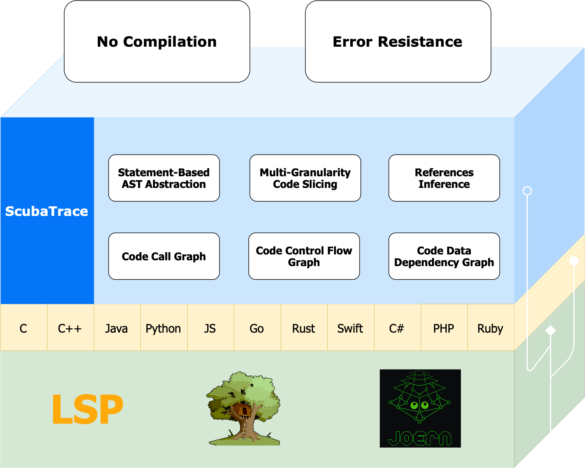

# ScubaTrace

Next-Generation Codebase Analysis Toolkit.



# Install

```bash
pip install scubatrace
```

# Features

- **Multi-Language Support (C, C++, Java, Python, JavaScript, Go)**
- **No Need To Compile**
- **Statement-Based AST Abstraction**
- **Code Call Graph**
- **Code Control Flow Graph**
- **Code Data/Control Dependency Graph**
- **References Inference**
- **CPG Based Multi-Granularity Slicing**

# Usage

## Project-Level Analysis

### Load a project (codebase)

```py
proj = scubatrace.CProject("path/to/your/codebase")
```

### Call Graph

```py
# Get the call graph of the project
callgraph = proj.callgraph
# Export call graph to a dot file
proj.export_callgraph("callgraph.dot")
```

### Code Search

```py
stat = proj.search_function("relative/path/to/your/file.c", start_line=20)
```

## File-Level Analysis

### Load a file from a project

```py
file = proj.files["relative/path/to/your/file.c"]
```

## Function-Level Analysis

### Load a function from a file

```py
the_first_func = file.functions[0]
func_in_tenth_line = file.function_by_line(10)
```

### Call Relationships

```py
callers = func.callers
callfrom, callto, callsite_line, callsite_column = (
    callers[0].src,
    callers[0].dst,
    callers[0].line,
    callers[0].column,
)
callees = func.callees
callfrom, callto, callsite_line, callsite_column = (
    callees[0].src,
    callees[0].dst,
    callees[0].line,
    callees[0].column,
)
```

### Function Control Flow Graph

```py
# Export the control flow graph to a dot file
func.export_cfg_dot("cfg.dot")
```

### Function Data Dependency Graph

```py
# Export the data dependency graph to a dot file
func.export_cfg_dot("ddg.dot", with_ddg=True)
```

### Function Control Dependency Graph

```py
# Export the control dependency graph to a dot file
func.export_cfg_dot("cdg.dot", with_cdg=True)
```

### Function Code Walk

```py
statements_you_interest = list(
    func.walk_backward(
        filter=lambda x: x.is_jump_statement,
        stop_by=lambda x: x.is_jump_statement,
        depth=-1,
        base="control",
    )
)
statements_you_interest = list(
    func.walk_forward(
        filter=lambda x: x.is_jump_statement,
        stop_by=lambda x: x.is_jump_statement,
        depth=-1,
        base="control",
    )
)
```

### Multi-Granularity Slicing

```py
# Slicing by lines
lines_you_interest = [4, 5, 19]
slice_statements = func.slice_by_lines(
    lines=lines_you_interest,
    control_depth=3,
    data_dependent_depth=5,
    control_dependent_depth=2,
)

# Slicing by statements
statements_you_interest = func.statements[0:3]
slice_statements = func.slice_by_statements(
    statements=statements_you_interest,
    control_depth=3,
    data_dependent_depth=5,
    control_dependent_depth=2,
)
```

## Statement-Level Analysis

### Load a statement from a function

```py
the_first_stmt = the_first_func.statements[0]
stmt_in_second_line = the_first_func.statement_by_line(2)
stmt_by_type = func.statements_by_type('tree-sitter Queries', recursive=True)
```

### Statement Controls

```
pre_controls: list[Statement] = stat.pre_controls
post_controls: list[Statement] = stat.post_controls
```

### Statement Data Dependencies

```py
pre_data_dependents: dict[Identifier, list[Statement]] = stat.pre_data_dependents
post_data_dependents: dict[Identifier, list[Statement]] = stat.post_data_dependents
```

### Statement Control Dependencies

```py
pre_control_dependents: list[Statement] = stat.pre_control_dependents
post_control_dependents: list[Statement] = stat.post_control_dependents
```

## AST Node

You can also get the AST node from a file, function, or statement.

```py
file_ast = file.node
func_ast = func.node
stmt_ast = stat.node
```
