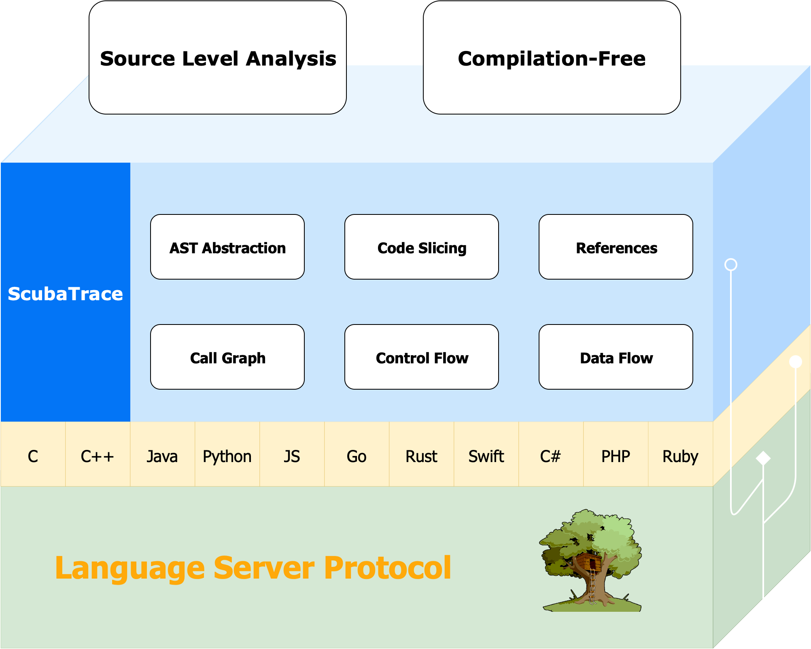

==========
ScubaTrace
==========

ScubaTrace is a code analysis toolkit that leverages tree-sitter and LSP (Language Server Protocol) to provide parsing, analysis, and context extraction capabilities for multiple programming languages.

Unlike most traditional static analysis tools that rely on compilation to extract Intermediate Representation (IR) for code analysis, ScubaTrace delivers analysis capabilities even when code repositories are incomplete or unable to compile. This resilience makes it particularly valuable for scenarios where traditional analysis approaches would fail, enabling developers and security researchers to gain insights from code that might otherwise be inaccessible to conventional static analysis methodologies.

Rather than being an end-to-end program analysis framework, ScubaTrace serves as a foundational toolkit that empowers developers to build solutions for IDE development, AI-powered coding tools, and SAST (Static Application Security Testing).

Install
==========

1. Install ScubaTrace:

.. code-block:: bash

    pip install scubatrace

.. note::

    If you encounter a ``pygraphviz`` installation failure during ``pip install``, you need to install the Graphviz development package. You can install it using the following command:

    .. code-block:: bash

        # For Debian/Ubuntu
        apt install libgraphviz-dev
        # For macOS, Ref: https://pygraphviz.github.io/documentation/stable/install.html#homebrew
        brew install graphviz

2. Import it to your project:

.. code-block:: python

    import scubatrace

.. toctree::
    :caption: Usage
    :hidden:

    usage

Features
===================

- **Multi-Language Support**
- **No Need To Compile**
- **Statement-Based AST Abstraction**
- **Code Call Graph**
- **Code Control Flow Graph**
- **Code Data/Control Dependency Graph**
- **References Inference**
- **CPG Based Multi-Granularity Slicing**
- **Built on Tree-sitter and LSP**

Supported Languages
===================

ScubaTrace supports multiple programming languages, including:

===================  ===========================  ========================  ========
Language             Language Server              Tree-sitter Parser        Maturity
===================  ===========================  ========================  ========
C/C++                clangd                       tree-sitter-cpp           High
Java                 Eclipse JDT LS               tree-sitter-java          High
Python               Pyright                      tree-sitter-python        High
JavaScript           typescript-language-server   tree-sitter-javascript    Medium
Go                   gopls                        tree-sitter-go            Medium
Rust                 Rust Analyzer                tree-sitter-rust          Medium
Ruby                 Solargraph                   tree-sitter-ruby          Low
Swift                SourceKit-LSP                tree-sitter-swift         Low
C#                   OmniSharp                    tree-sitter-c-sharp       Low
PHP                  phpactor                     tree-sitter-php           Low
===================  ===========================  ========================  ========

Reference
==========
.. autosummary::
   :toctree: classes
   :caption: Reference
   :nosignatures:

   scubatrace.Project
   scubatrace.File
   scubatrace.Function
   scubatrace.Statement
   scubatrace.Identifier
   scubatrace.Parser
   scubatrace.Language

.. toctree::
    :caption: DEVELOPMENT
    :hidden:

    contributing
    GitHub <https://github.com/SunBK201/ScubaTrace>
    license

Source Code
===========

GitHub: `https://github.com/SunBK201/ScubaTrace <https://github.com/SunBK201/ScubaTrace>`_
